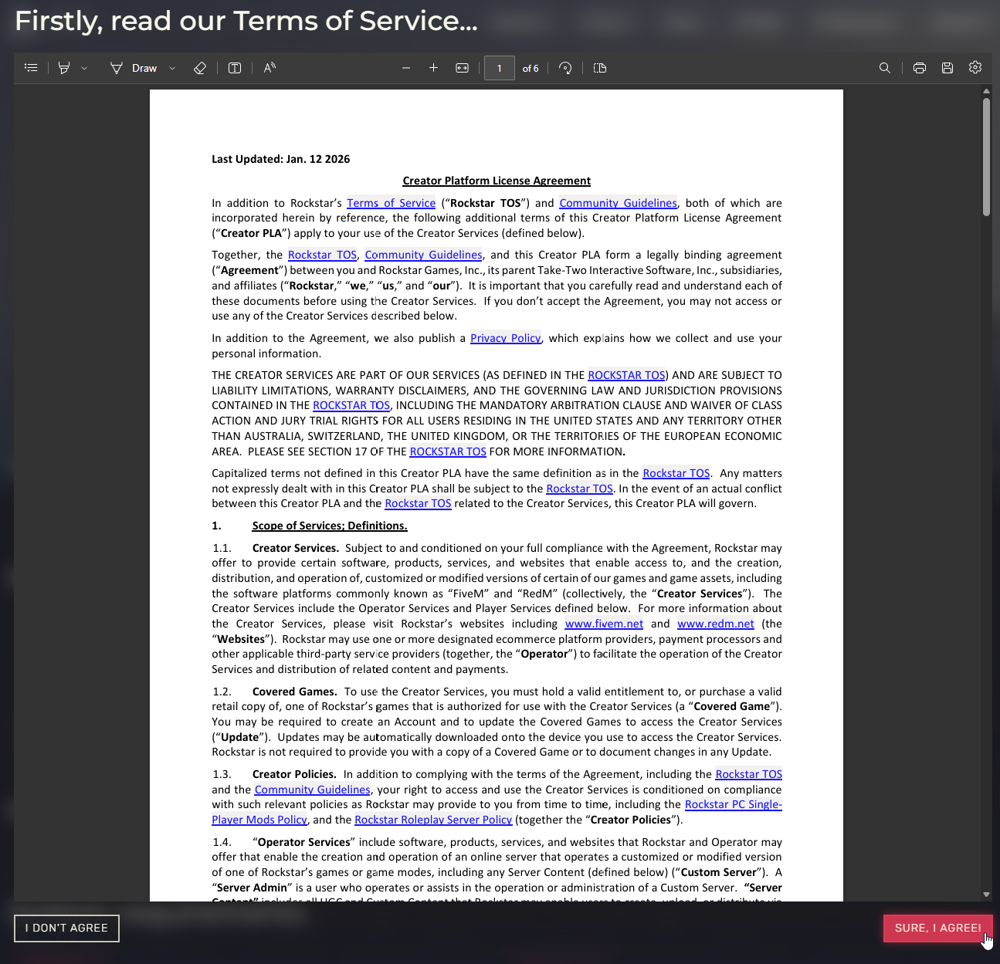
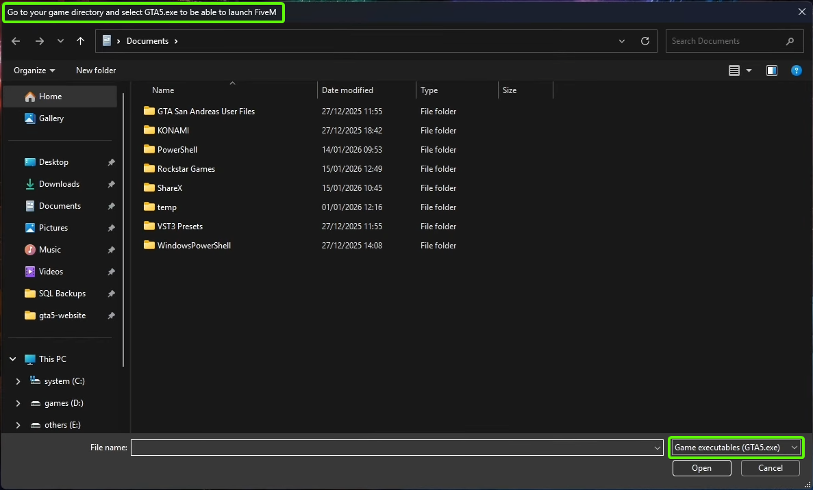
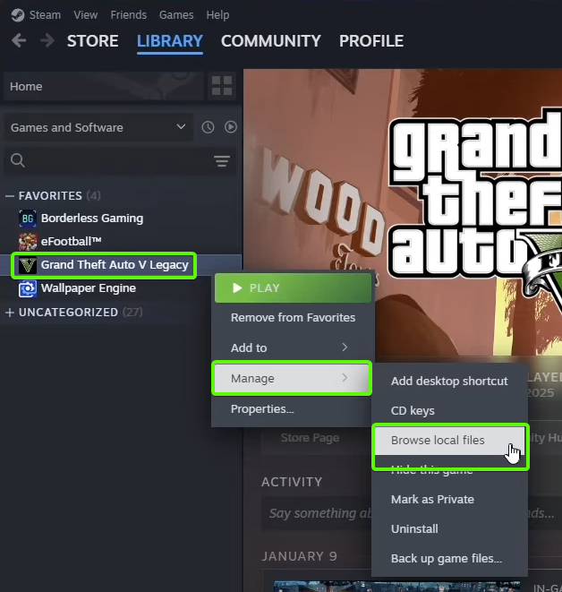
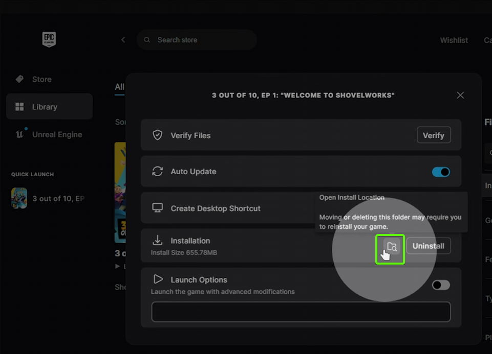
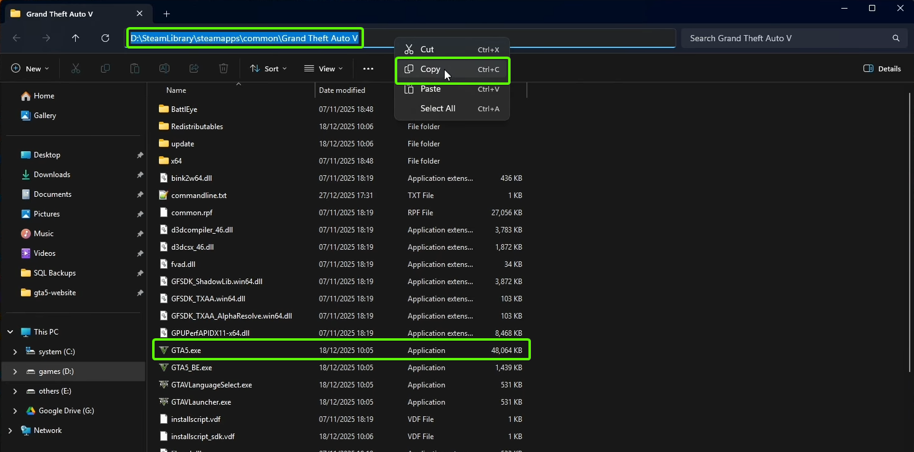
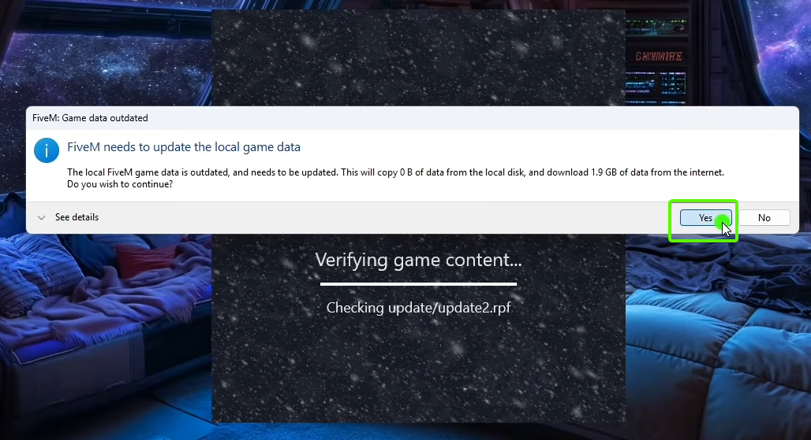
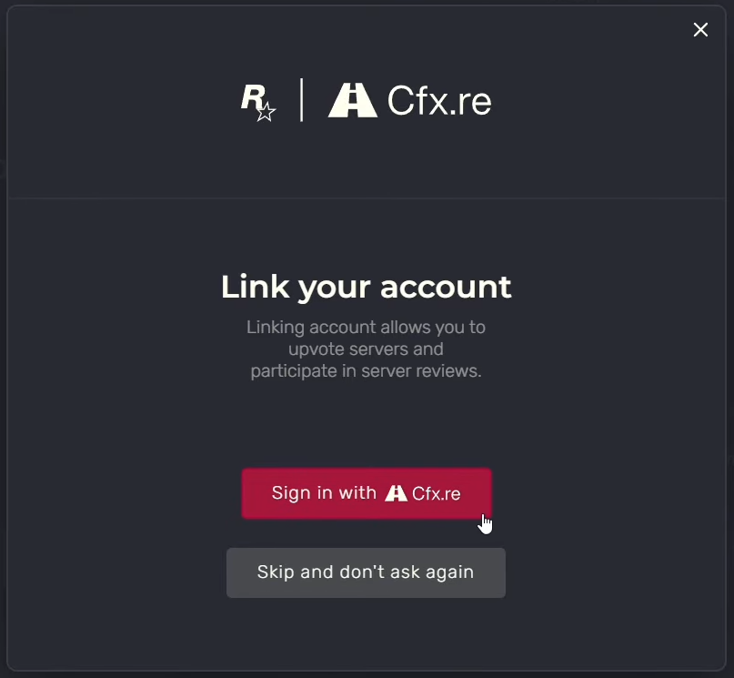
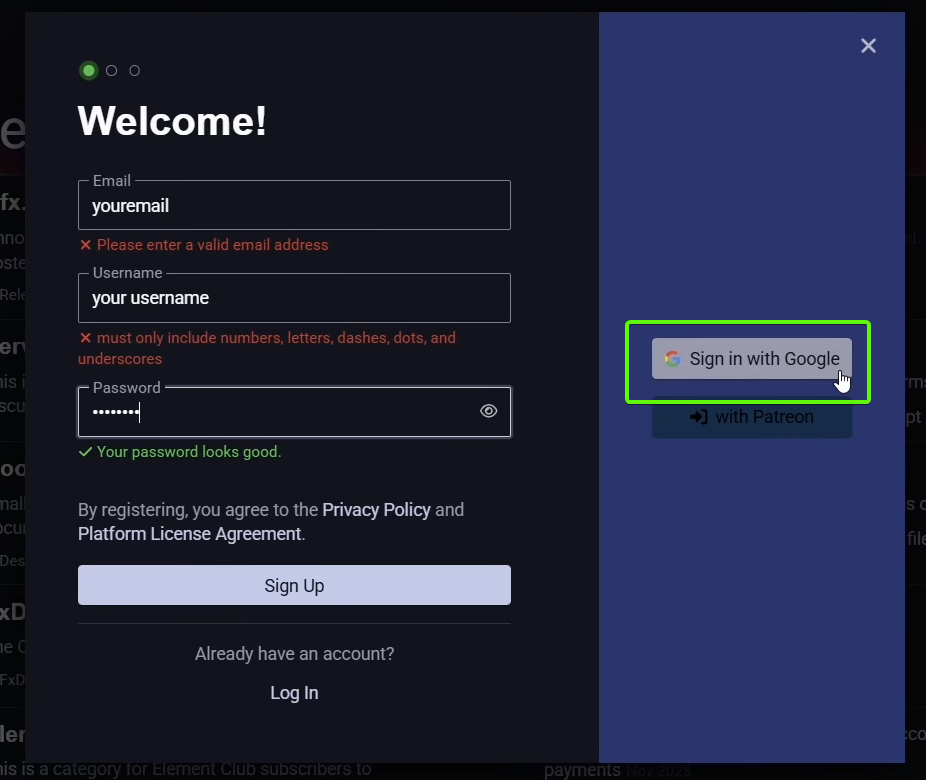
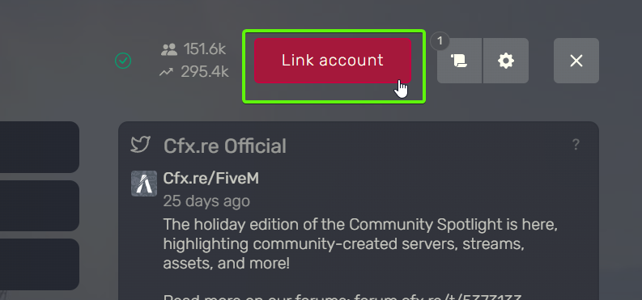

# Server Wiki

## What is FiveM?

FiveM is a modification for Grand Theft Auto V (GTA V), which allows you to play on dedicated multiplayer servers.

## How to install FiveM (video)?

Below you have a video tutorial about installing the FiveM client. 
Under the video tutorial you will find a text tutorial with additional explanations and the same steps as in the video.

  <iframe width="920" height="480" src="https://www.youtube.com/embed/2ejRxGnu1l0" frameborder="0" allowfullscreen></iframe>

## How to install FiveM (text)?

### 1. PC Requirements:

- Windows 10 or newer
- Processor: Intel Core 2 Q6600 @ 2.40GHz / AMD Phenom 9850 @ 2.5GHz or newer
- Graphics card: NVIDIA 9800 GT 1GB / AMD HD 4870 1GB / Intel HD GT2 or newer
- RAM: 8GB or more
- Storage: 130GB

### 2. Requirements

- it is mandatory to own an original copy of the game Grand Theft Auto V (GTA V).
- GTA V can be purchased through <a href="https://store.steampowered.com/app/3240220/Grand_Theft_Auto_V_Enhanced/" target="_blank">Steam</a>, <a href="https://store.epicgames.com/en-US/p/grand-theft-auto-v" target="_blank">Epic Games</a> or <a href="https://www.rockstargames.com/gta-v" target="_blank">Rockstar Launcher</a>.
- install the game after you have purchased it.

!!! danger "Important"
	- on our server, accounts are linked to the game license. 
	- losing the account where you purchased the game (Steam, Epic Games, Rockstar Launcher) or suspension of the license by Rockstar (you received a ban from them) will result in loss of access to the server.

### 3. FiveM Installation

<figure markdown="span">
    { width="800" }
</figure>

- the FiveM client is downloaded from the official website <a href="https://fivem.net/" target="_blank">https://fivem.net/</a>.
- click on the big button on the right that says "DOWNLOAD CLIENT".

<figure markdown="span">
    { width="800" }
</figure>

- you will need to read the FiveM terms and conditions of use and click on the "SURE, I AGREE!" button to agree with them.

<figure markdown="span">
    { width="400" }
</figure>

- you will need to open the downloaded installer and let it update and install itself.

<figure markdown="span">
    { width="800" }
</figure>

- after it installs, you will be prompted to select the path (PATH) where you have GTA V installed and where the executable GTA5.exe is located.

!!! danger "Important"
	- FiveM currently only works with GTA V Legacy (GTA5.exe), not with GTA V Enhanced! 
	- DO NOT select the GTA V Enhanced executable (GTA5_Enhanced.exe) at this step because it will not work.

- the default (standard) locations where the executable can be found are:
	- Steam: C:\Program Files (x86)\Steam\steamapps\common\Grand Theft Auto V 
	- Epic Games: C:\Program Files\Epic Games\Grand Theft Auto V 
	- Rockstar Launcher: C:\Program Files\Rockstar Games\Grand Theft Auto V

- if you installed the programs in other custom locations, you need to search where you installed them.

#### Steam PATH Location

??? tip "How to find the PATH on Steam?"
	<figure markdown="span">
	    { width="600" }
	</figure>
	
	- to discover the location on Steam, right-click on the game in "Library", then select "Manage", then "Browse Local Files".

#### Epic Games PATH Location

??? tip "How to find the PATH on Epic Games?"
	<figure markdown="span">
	    { width="600" }
	</figure>
	
	- to discover the location on Epic Games, click on "Library", then on the 3 dots next to the game title, then on "Manage".
	
	<figure markdown="span">
	    { width="600" }
	</figure>
	
	- then on the right side of the "Installation" section, click on the browse files icon.

#### Rockstar Launcher PATH Location

??? tip "How to find the PATH on Rockstar Launcher?"
	<figure markdown="span">
	    { width="800" }
	</figure>
	
	- to discover the location on Rockstar Launcher, click on "SETTINGS", then select the game Grand Theft Auto V, then click on "OPEN" next to the "View Installation Folder" field.

<figure markdown="span">
    { width="800" }
</figure>

- a window will open with the location where the game is installed (we are interested in GTA5.exe).
- copy the path from the address bar of the window by right-clicking and selecting the copy option.

<figure markdown="span">
    { width="600" }
</figure>

- the copied path must be pasted into the original FiveM installer window. 
- press ENTER after you have pasted the address to get to the GTA5.exe executable. 
- select it and click on the "OPEN" button.

<figure markdown="span">
    { width="600" }
</figure>

- after you have selected the path to GTA5.exe, the installer will continue its installation.
- approve the updates it needs.

<figure markdown="span">
    { width="600" }
</figure>

- as soon as the installation and update are completed, the FiveM client will open where you will need to accept the Terms and Conditions of use again.

### 4. Cfx.re Association

- this step is optional to play on a FiveM server, but in the case of our server it is mandatory to be able to use the panel.

#### Initial Association

<figure markdown="span">
    { width="600" }
</figure>

- on the first opening of the FiveM client you will see the window above where you can connect your cfx.re account.
- by clicking on the "Sign in" button, the browser will open on the cfx.re forum where you can log in and where you can create an account if you don't already have one.

<figure markdown="span">
    { width="800" }
</figure>

- if you already have a [forum.cfx.re](https://forum.cfx.re) account then simply log in to your account or authorize the connection if you were already logged in.
- if you don't have an account, click on the "Sign Up" button and register an account.

<figure markdown="span">
    { width="800" }
</figure>

- the easiest way is to log in directly with your Google account.
- alternatively you can create an account with email, username and password.

!!! danger "Important"
	- be careful not to lose access to your email address because you risk losing your cfx.re account as well 
	- do not share your cfx.re account with other people because they will gain login access to our server panel.

#### Later Association

<figure markdown="span">
    { width="800" }
</figure>

- in case you skipped the cfx.re account association on the first opening of the FiveM client, you can do this later from the client settings by clicking on the "Link account" button in the upper right.

## 5. Connecting to the Server

<figure markdown="span">
    { width="800" }
</figure>

- to connect to a server, click on the big "PLAY" button to open the server list.
- you can search for the server by name by typing its name in the search box.

<figure markdown="span">
    { width="800" }
</figure>

- alternatively, if you know the DNS address of the server, you can enter it in the format >rpg.domain.com and press the ENTER key.
- you can also do the same with the IP address if you know it and enter >111.111.111.111 (its IP).

!!! note "Good to know"
	- when connecting to FiveM servers, the necessary resources will be downloaded to be able to play on the server. 
	- this can take time depending on your connection and the server connection, so you will need to wait. 
	- if you have problems related to resources or their corruption, visit the Issues section (to be linked) for tips.
