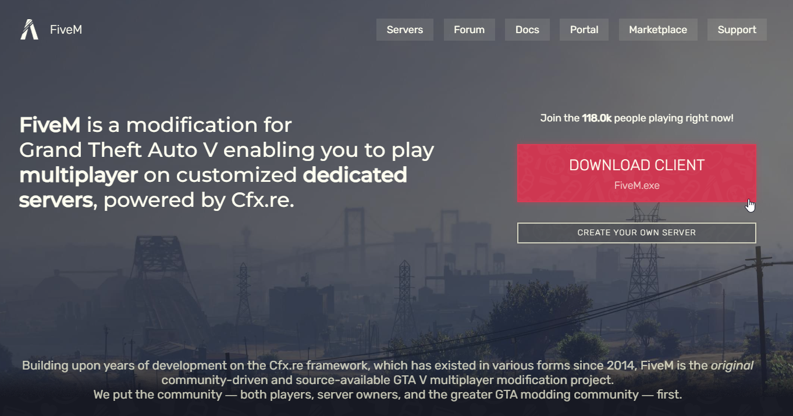
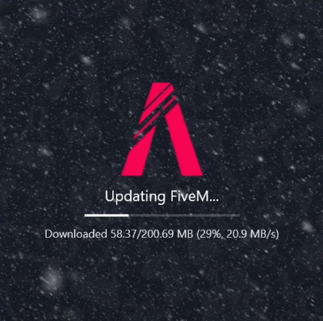
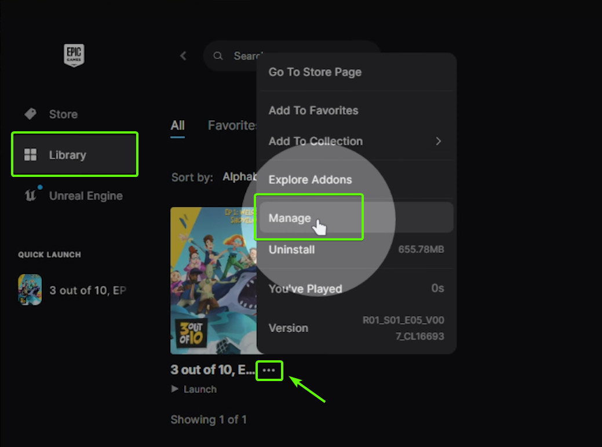
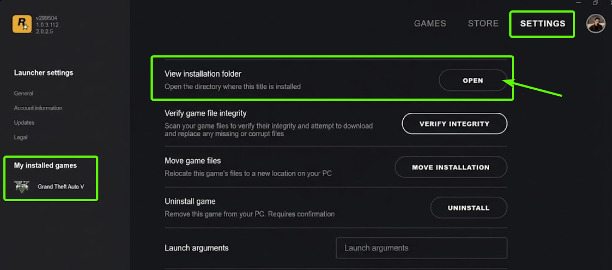
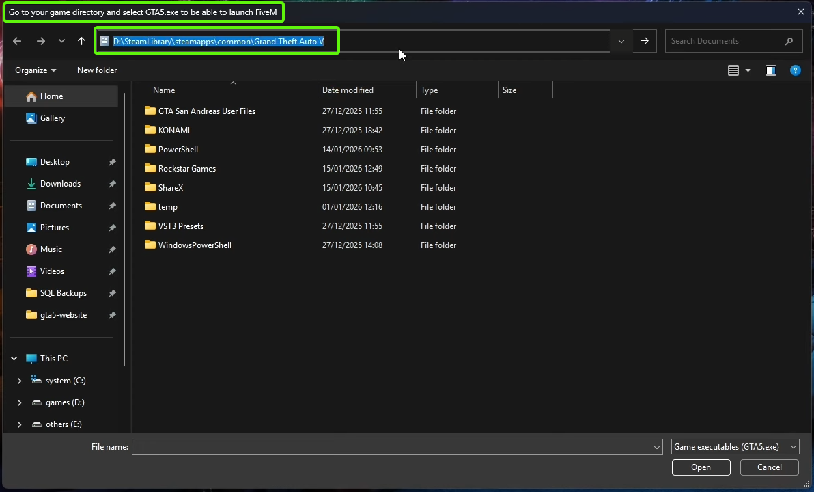
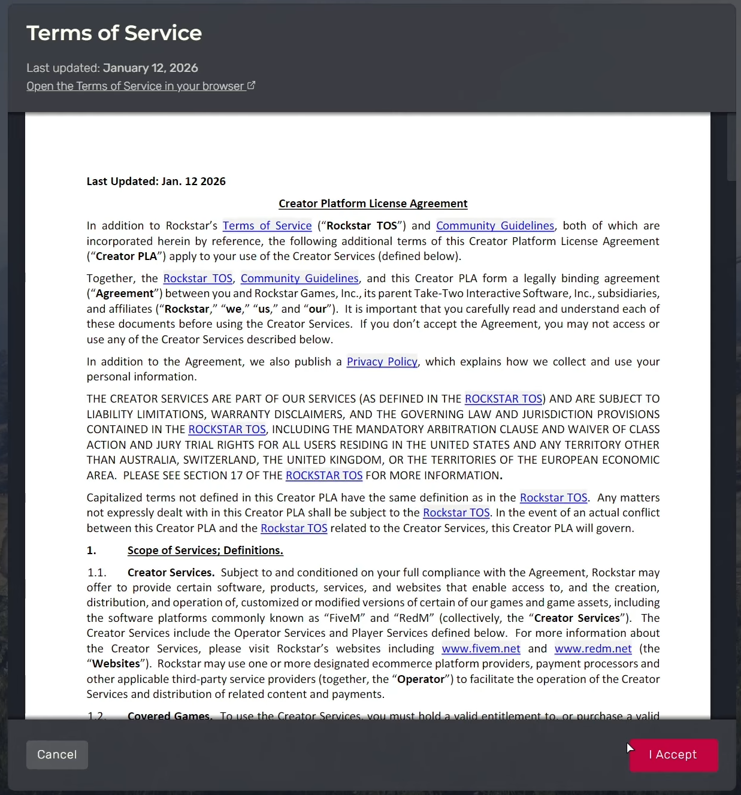
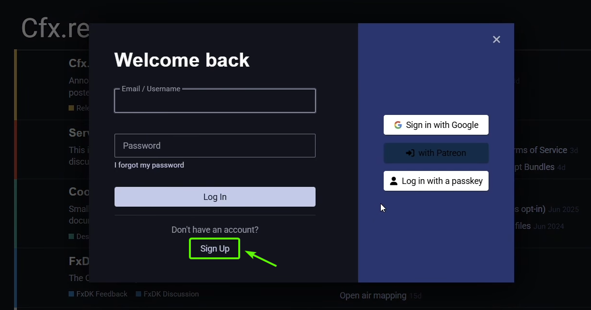
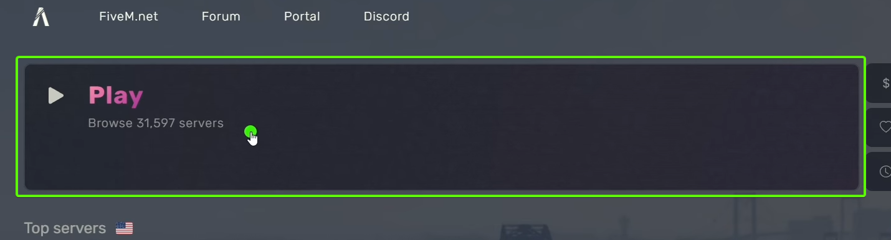
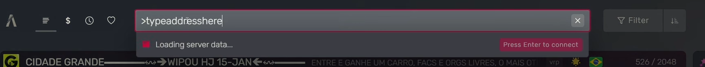

# Wiki Server

## Ce este FiveM?

FiveM este o modificare pentru Grand Theft Auto V (GTA V), care-ti permite sa joci pe servere multiplayer dedicate.

## Cum instalezi FiveM (video)?

Mai jos aveti un tutorial video despre instalarea clientului de FiveM. 
Sub tutorialul video veti gasi un tutorial text cu explicatii suplimentare si aceiasi pasi precum in video.

  <iframe width="920" height="480" src="https://www.youtube.com/embed/2ejRxGnu1l0" frameborder="0" allowfullscreen></iframe>

## Cum instalezi FiveM (text)?

### 1. Cerinte PC:

- Windows 10 sau mai nou
- Procesor: Intel Core 2 Q6600 @ 2.40GHz / AMD Phenom 9850 @ 2.5GHz sau mai nou
- Placa video: NVIDIA 9800 GT 1GB / AMD HD 4870 1GB / Intel HD GT2 sau mai noua
- RAM: 8GB sau mai mult
- Stocare: 130GB

### 2. Necesitati

- este obligatoriu sa detineti o copie originala a jocului Grand Theft Auto V (GTA V).
- GTA V poate fi achizitionat prin <a href="https://store.steampowered.com/app/3240220/Grand_Theft_Auto_V_Enhanced/" target="_blank">Steam</a>, <a href="https://store.epicgames.com/en-US/p/grand-theft-auto-v" target="_blank">Epic Games</a> sau <a href="https://www.rockstargames.com/gta-v" target="_blank">Rockstar Launcher</a>.
- instalati jocul dupa ce l-ati achizitionat.

!!! danger "Important"
	- pe serverul nostru conturile sunt legate de licenta jocului. 
	- pierderea contului unde ati cumparat jocul (Steam, Epic Games, Rockstar Launcher) sau suspendarea licentei de catre Rockstar (ati primit ban de la ei) va duce la pierderea accesului la server.

### 3. Instalare FiveM

<figure markdown="span">
    { width="800" }
</figure>

- clientul de FiveM se descarca de pe site-ul oficial <a href="https://fivem.net/" target="_blank">https://fivem.net/</a>.
- faceti click pe butonul mare din partea dreapta care spune "DOWNLOAD CLIENT".

<figure markdown="span">
    { width="800" }
</figure>

- va trebui sa cititi termenii si conditiile de utilizare ale FiveM si sa faceti click pe butonul "SURE, I AGREE!" cum ca sunteti de acord cu acestea.

<figure markdown="span">
    { width="400" }
</figure>

- va trebui deschideti installerul descarcat si sa-l lasati sa isi faca update, respectiv sa se instaleze.

<figure markdown="span">
    { width="800" }
</figure>

- dupa ce se instaleaza o sa va apara sa selectati calea (PATH-ul) unde aveti instalat jocul GTA V si unde se regaseste executabilul GTA5.exe.

!!! danger "Important"
	- FiveM momentan nu functioneaza decat cu GTA V Legacy (GTA5.exe), nu cu GTA V Enhanced! 
	- NU selectati la acest pas executabilul GTA V Enhanced (GTA5_Enhanced.exe) deoarece nu va functiona.

- locatiile default (standard) unde se regaseste executabilul sunt:
	- Steam: C:\Program Files (x86)\Steam\steamapps\common\Grand Theft Auto V 
	- Epic Games: C:\Program Files\Epic Games\Grand Theft Auto V 
	- Rockstar Launcher: C:\Program Files\Rockstar Games\Grand Theft Auto V

- daca ati instalat programele in alte locatii custom, acolo unde le-ati instalat trebuie sa cautati.

#### Locatie PATH Steam

??? tip "Cum gasesti PATH-ul pe Steam?"
	<figure markdown="span">
	    { width="600" }
	</figure>
	
	- pentru a descoperi locatia pe Steam faceti click dreapta pe joc in "Library", apoi selectati "Manage", apoi "Browse Local Files".

#### Locatie PATH Epic Games

??? tip "Cum gasesti PATH-ul pe Epic Games?"
	<figure markdown="span">
	    { width="600" }
	</figure>
	
	- pentru a descoperi locatia pe Epic Games faceti click pe "Library", apoi pe cele 3 puncte din dreptul titului jocului, apoi pe "Manage".
	
	<figure markdown="span">
	    { width="600" }
	</figure>
	
	- apoi in partea dreapta a rubricii "Installation" faceti click pe iconita de browse files.

#### Locatie PATH Rockstar Launcher

??? tip "Cum gasesti PATH-ul pe Rockstar Launcher?"
	<figure markdown="span">
	    { width="800" }
	</figure>
	
	- pentru a descoperi locatia pe Rockstar Launcher faceti click pe "SETTINGS", apoi selectati jocul Grand Theft Auto V, apoi faceti click pe "OPEN" din dreptul campului "View Installation Folder".

<figure markdown="span">
    { width="800" }
</figure>

- vi se va deschide o fereastra cu locatia unde e instalat jocul (ne intereseaza GTA5.exe).
- copiati calea din bara de adrese a ferestrei facand click dreapta si selectand optiunea de copiere.

<figure markdown="span">
    { width="600" }
</figure>

- calea copiata trebuie lipita in fereastra originala a installerului de FiveM. 
- apasati ENTER dupa ce ati lipit adresa pentru a ajunge la executabilul GTA5.exe. 
- il selectati si faceti click pe butonul de "OPEN".

<figure markdown="span">
    { width="600" }
</figure>

- dupa ce ati selectat calea catre GTA5.exe installerul isi va continua instalarea.
- aprobati actualizarile de care are nevoie.

<figure markdown="span">
    { width="600" }
</figure>

- de indata ce instalarea si actualizarea au fost finalizate vi se va deschide clientul de FiveM unde va trebui sa acceptati din nou Termenii si Conditiile de utilizare.

### 4. Asociere cfx.re

- acest pas este optional pentru a juca pe un server de FiveM, dar in cazul serverului nostru este obligatoriu pentru a putea utiliza panelul.

#### Asocierea Initiala

<figure markdown="span">
    { width="600" }
</figure>

- la prima deschidere a clientului de FiveM veti vedea fereastra de mai sus unde puteti sa va conectati contul de cfx.re.
- facand click pe butonul de "Sign in" o sa vi se deschida browserul pe forumul cfx.re unde va puteti conecta si unde va puteti crea un cont daca nu aveti deja.

<figure markdown="span">
    { width="800" }
</figure>

- daca aveti deja un cont de [forum.cfx.re](https://forum.cfx.re) atunci pur si simplu conectati-va la cont sau autorizati conexiunea daca ati fost deja conectati.
- daca nu aveti cont, faceti click pe butonul de "Sign Up" si inregistrati-va un cont.

<figure markdown="span">
    { width="800" }
</figure>

- cel mai simplu este sa va conectati direct cu contul de Google.
- alternativ puteti crea un cont cu email, username si parola.

!!! danger "Important"
	- aveti grija sa nu va pierdeti accesul la adresa de email deoarece riscati sa va pierdeti si contul de cfx.re 
	- nu va impartiti contul de cfx.re cu alte persoane deoarece vor dobandi acces de conectare la panelul serverului nostru.

#### Asocierea Ulterioara

<figure markdown="span">
    { width="800" }
</figure>

- in cazul in care ati omis asocierea contului de cfx.re la prima deschidere a clientului FiveM, puteti face acest lucru ulterior din setarile clientului facand click pe butonul din partea dreapta superioara de "Link account".

## 5. Conectarea la Server

<figure markdown="span">
    { width="800" }
</figure>

- pentru a va conecta la un server faceti click pe butonul mare de "PLAY" pentru a deschide lista de servere.
- puteti cauta serverul dupa nume tastand numele acestuia in casuta de cautare.

<figure markdown="span">
    { width="800" }
</figure>

- alternativ daca cunoasteti adresa DNS a serverului o puteti introduce in formatul >rpg.domeniu.com si sa apasati tasta ENTER.
- la fel puteti face si cu adresa IP daca o cunoasteti si sa introduceti >111.111.111.111 (IP-ul acestuia).

!!! note "De stiut"
	- la conectarea pe serverele de FiveM se vor descarca resursele necesare pentru a putea juca pe server. 
	- acest lucru poate sa dureze in functie de conexiunea voastra si de conexiunea serverului, asadar va trebui sa asteptati. 
	- daca aveti probleme legate de resurse sau coruperea acestora, vizitati sectiunea de Probleme (to be linked) pentru sfaturi.
